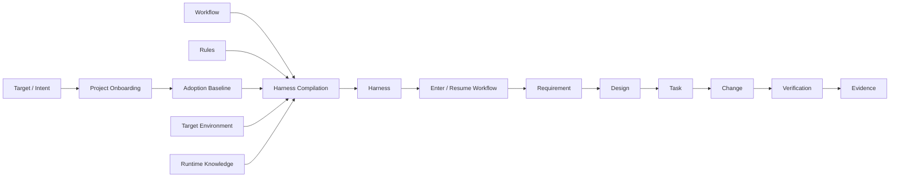

# Spec Coding

> **AI can write code. Spec Coding keeps it aligned.**

Spec Coding / SDD（Specification-Driven Development，规格驱动开发）是一套面向 AI Coding 的轻量、可追溯开发方法。

它不尝试规定某一种语言、框架或 Agent，而是把模糊意图逐步收敛为可追溯的 Requirement → Design → Task → Change → Verification，并通过 Meta Protocol（元协议）先建立项目接入关系，再把适用 Workflow（流程）、Rules（规则）与项目环境转换成当前项目真正需要的最小 Harness（执行框架）。

**Version:** [`0.10.0`](VERSION) · **Status:** `candidate`

---

## Why Spec Coding?

AI 生成代码越来越便宜，真正困难的是让它在长链路中持续保持对齐：

```text
需求理解漂移
    ↓
设计与实现失联
    ↓
任务边界不断扩张
    ↓
验证只证明“能跑”
    ↓
结果很快，但不可信
```

Spec Coding 关注的不是“怎样让 Agent 多写代码”，而是：

- **Alignment｜对齐**：需求、设计、任务与实现持续指向同一个目标。
- **Traceability｜可追溯**：结果可以回查到它来自哪个 Requirement、Design、Task 与 Evidence。
- **Bounded Autonomy｜有边界的自治**：Agent 在明确契约内自主推进，超出边界时回到正确上游。
- **Human-Agent Collaboration｜人机协作**：Human 不跟踪 Agent 的全部工作上下文，但在关键认知变化与决策边界保持足够的判断上下文。
- **Agent Delegation｜Agent 委派**：Main Agent 持有全局一致性与最终责任，Subagent 只承担可隔离、可验证且权限有界的局部工作。
- **Verification｜验证**：用可复核证据证明结果，而不是接受 Agent 的自我声明。
- **Adaptation｜适配**：规范保持稳定，具体接入与 Harness 根据使用意图、项目约束和当前 Coding Agent Runtime 能力动态适配。

---

## How it works



可以把 Spec Coding 理解成三个规范层，以及两个项目侧运行结果：

| Layer | 它回答的问题 |
|---|---|
| **Workflow｜流程** | 下一步应该做什么，状态如何推进？ |
| **Rules｜规则** | 推进与协作过程中必须持续保持什么？ |
| **Meta Protocol｜元协议** | Spec Coding 如何被项目接入，并转换为可执行机制？ |
| **Adoption Baseline｜接入基线** | 当前 Target 如何使用 Spec Coding，哪些意图、绑定与约束需要长期稳定？ |
| **Harness｜执行框架** | 当前项目最终由哪些 Agent、Rule、Tool、Gate、Script 等机制实际承载这些要求？ |

Reference 作为非规范知识层，为 Harness Compilation 提供跨 Runtime 的 Harness Primitive、Coding Agent Architecture Invariant 与官方事实入口；当前 Runtime Capability 仍由编译时的 Official / Local Evidence 决定。

> **Onboarding establishes the relationship. Workflow and Rules define the contract. Harness Compilation makes it executable.**

---

## Use it with your coding agent

不要求你手工执行 `Onboard Project`、`Build Harness` 或把流程翻译成 Skill、Rule、Agent 配置。

把 **Spec Coding** 与**目标项目 / Intent** 提供给 Coding Agent，然后直接表达目标，例如：

```text
按照 Spec Coding 接入当前项目，并按当前任务继续推进。
```

Agent 应自行完成：

```text
Project Onboarding（若需要）
        ↓
Adoption Baseline
        ↓
Harness Compilation（若需要）
        ↓
Harness Ready
        ↓
01A / 01B / Resume
```

- [`Project Onboarding Protocol`](docs/meta-protocols/project-onboarding.md) 负责识别 Target、协作 / 发布方式、Spec Workspace、稳定 Repository / Authority 约束，以及 Existing Adoption 是否需要 Reuse / Refresh / Migrate。
- [`Harness Compilation Protocol`](docs/meta-protocols/harness-compilation.md) 消费有效 Adoption Baseline、Applicable Workflow / Rules 与当前 Target Environment；先把规范要求归一为必要 Harness Primitive，再结合 Runtime Architecture Reference、当前官方资料与 Local Runtime Evidence 映射为当前 Coding Agent 的真实 Surface，只补真实 Capability / Reliability / Selection Gap，并按最低充分能力形成 Agent / Model / Thinking / Context / Tool / Workspace 路由。

已有 Adoption Baseline 与 Harness 仍有效时直接复用，因此普通 Requirement / Task 不需要重复初始化。

---

## Workflow

Spec Coding 同时支持 Greenfield（新项目）、Brownfield（存量项目）与 Existing State Resume（已有流程状态恢复）：

```text
新项目：项目定义建立 ─┐
存量项目：项目认知建立 ┼→ 需求澄清 → 技术方案设计 → 实施规划 → 开发实施 → 验证收敛 → 流程复盘改进
已有状态：Resume ─────┘
```

其中：

1. **项目定义 / 认知建立**：先知道正在构建什么，或当前系统真实是什么。
2. **需求澄清**：把意图收敛成范围、规则与可验证 Acceptance Criteria。
3. **技术方案设计**：理解影响，做出技术决策，并形成可实施方案。
4. **实施规划**：把设计拆成可执行、可验证、可追踪的 Task。
5. **开发实施**：Agent 在 Task Contract 内自治实现、局部验证并形成稳定代码引用。
6. **验证收敛**：独立验证完整 Change Set，并用 Evidence 收敛结果。
7. **流程复盘改进**：从真实执行证据中改进可复用的 Workflow、Rules、Meta Protocol 与 Harness 机制。

异常不会被强行塞进 Happy Path：跨阶段 Failure、Defect 或无法可靠归因的问题由独立 [`Exception Workflow`](docs/workflows/exceptions/README.md) 按需承接。目前已完成 [`Debug & Defect Resolution`](docs/workflows/exceptions/debug-and-defect-resolution/README.md) 四阶段流程，处理异常接管、证据定位、根因确认、纠正路由与故障关闭，并在完成后回接主流程。

---

## Principles

Spec Coding 尽量保持轻量，核心设计可以压缩成几句话：

> **Process for cognition. Artifacts for alignment. Evidence for trust.**

- **Process as Cognition｜流程用于认知**：流程帮助 Agent 正确理解与推进，不要求把所有中间思考形式化。
- **Artifact as Contract｜产物用于对齐**：只对真正需要跨阶段交接和验证的结果建立稳定契约。
- **Evidence over Claim｜证据优于声明**：是否完成由证据决定，不由执行者自述决定。
- **Decision-ready Human｜保持 Human 可判断**：需要 Human 介入时先同步最小充分认知，而不是让 Human 从 Agent 的全部工作历史重建上下文。
- **Delegate Work, Not Accountability｜委派工作，不转移责任**：Main Agent 可以委派局部工作，但继续持有 Workflow State、结果整合与最终责任。
- **Affected Trace Only｜只处理受影响链路**：发现偏差时修正最早失效事实源，只重新对齐真正受影响的部分。
- **Persist Intent, Rediscover Facts｜持久化意图，重发现动态事实**：接入基线只保存长期意图与稳定绑定，不复制易变环境。
- **Reference Guides Discovery｜参考指导发现**：固化跨 Runtime 的共同语言、架构不变量与官方入口，但不把 Reference 当成当前 Runtime 真相。
- **Minimum Sufficient Harness｜最小充分 Harness**：优先复用项目已有能力，只补真实 Capability / Reliability / Selection Gap。
- **Minimum Sufficient Capability｜最低充分能力**：模型与 Thinking 选择以可靠满足当前 Contract 为目标，不统一使用最强或最便宜配置。

---

## Explore

| 我想…… | 从这里开始 |
|---|---|
| 快速理解整套方法 | [`docs/overview.md`](docs/overview.md) |
| 查看完整文档架构 | [`docs/README.md`](docs/README.md) |
| 把 Spec Coding 接入当前项目 | [`docs/meta-protocols/project-onboarding.md`](docs/meta-protocols/project-onboarding.md) |
| 构建 / 重编译最小 Harness | [`docs/meta-protocols/harness-compilation.md`](docs/meta-protocols/harness-compilation.md) |
| 查看 Harness Primitive / 开放标准参考 | [`docs/reference/harness-primitives.md`](docs/reference/harness-primitives.md) |
| 查看 Coding Agent Runtime 架构与官方入口 | [`docs/reference/coding-agent-runtimes.md`](docs/reference/coding-agent-runtimes.md) |
| 查看 Meta Protocol 层 | [`docs/meta-protocols/README.md`](docs/meta-protocols/README.md) |
| 查看 Main / Exception Workflow | [`docs/workflows/README.md`](docs/workflows/README.md) |
| 查看人机共享认知与决策协作规则 | [`docs/rules/human-agent-collaboration.md`](docs/rules/human-agent-collaboration.md) |
| 查看 Main Agent / Subagent 委派与模型路由规则 | [`docs/rules/agent-delegation-and-coordination.md`](docs/rules/agent-delegation-and-coordination.md) |
| 处理 Debug / Defect / 难以归因的异常 | [`docs/workflows/exceptions/debug-and-defect-resolution/README.md`](docs/workflows/exceptions/debug-and-defect-resolution/README.md) |
| 查看所有 Workflow 共同继承的规则 | [`docs/rules/global-contracts.md`](docs/rules/global-contracts.md) |
| 查看通用代码质量原则 | [`docs/rules/code-quality.md`](docs/rules/code-quality.md) |
| 查术语与规范中文解释 | [`docs/reference/glossary.md`](docs/reference/glossary.md) |
| 维护或演进 Spec Coding 本身 | [`docs/governance/repository-governance.md`](docs/governance/repository-governance.md) |
| 查看机器可读规范入口 | [`docs/manifest.yaml`](docs/manifest.yaml) |
| 查看版本变化 | [`CHANGELOG.md`](CHANGELOG.md) |

---

## Project status

当前版本仍处于 `candidate` 阶段。Main Workflow、Rules、Debug Exception Workflow 与 Meta Protocol 层已建立版本治理；Meta Protocol 当前包含 Project Onboarding 与 Harness Compilation。进入 `1.0.0` 前仍需要 Scenario Stress Test（场景压力测试）、Fresh-Agent Blind Run（新 Agent 盲跑）与真实项目 Pilot（试运行）。

如果你第一次来到这里，建议从 [`Spec Coding 全流程概要`](docs/overview.md) 开始。

---

## License

除非另有说明，本仓库的文档、规范、图示及其他非软件内容采用 [Creative Commons Attribution 4.0 International](LICENSE)（CC BY 4.0）许可。