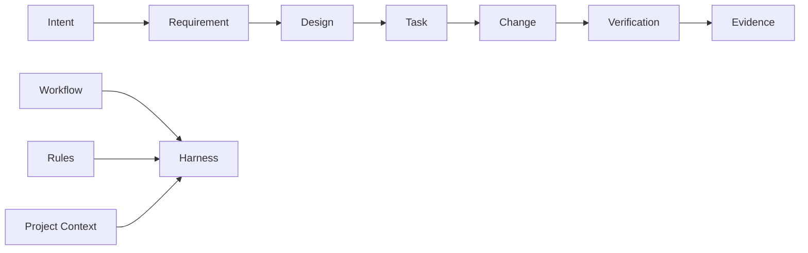

# Spec Coding

> **AI can write code. Spec Coding keeps it aligned.**

Spec Coding / SDD（Specification-Driven Development，规格驱动开发）是一套面向 AI Coding 的轻量、可追溯开发方法。

它不尝试规定某一种语言、框架或 Agent，而是把模糊意图逐步收敛为可追溯的 Requirement → Design → Task → Change → Verification，并结合项目上下文，将适用的 Workflow（流程）与 Rules（规则）转换成当前项目真正需要的最小 Harness（执行框架）。

**Version:** [`0.6.0`](VERSION) · **Status:** `candidate`

---

## Why Spec Coding?

AI 生成代码越来越便宜，真正困难的是让它在长链路中持续保持对齐：

```text
需求理解漂移
    ↓
设计与实现失联
    ↓
任务边界不断扩张
    ↓
验证只证明“能跑”
    ↓
结果很快，但不可信
```

Spec Coding 关注的不是“怎样让 Agent 多写代码”，而是：

- **Alignment｜对齐**：需求、设计、任务与实现持续指向同一个目标。
- **Traceability｜可追溯**：结果可以回查到它来自哪个 Requirement、Design、Task 与 Evidence。
- **Bounded Autonomy｜有边界的自治**：Agent 在明确契约内自主推进，超出边界时回到正确上游。
- **Human-Agent Collaboration｜人机协作**：Human 不跟踪 Agent 的全部工作上下文，但在关键认知变化与决策边界保持足够的判断上下文。
- **Verification｜验证**：用可复核证据证明结果，而不是接受 Agent 的自我声明。
- **Adaptation｜适配**：规则保持稳定，具体 Harness 根据项目已有能力动态生成。

---

## How it works



可以把 Spec Coding 理解成三个层次：

| Core | 它回答的问题 |
|---|---|
| **Workflow｜流程** | 下一步应该做什么，状态如何推进？ |
| **Rules｜规则** | 推进过程中必须持续保持什么？ |
| **Harness｜执行框架** | 如何把 Workflow + Rules 适配成当前项目可执行的机制？ |

> **Workflow tells the Agent where to go. Rules tell it what must remain true. Harness makes both executable.**

---

## Use it with your coding agent

这里没有一个名为 `Build Harness` 的 CLI，也不要求你手工把流程翻译成 Skill、Rule 或 Agent 配置。

把 **Spec Coding 仓库**与**目标项目**提供给 Coding Agent，然后给它一个明确意图即可，例如：

```text
根据 Spec Coding，为当前项目构建最小充分 Harness，并按当前任务继续推进。
```

Agent 应按照 [`Harness Compilation Protocol`](docs/harness-compilation-protocol.md) 完成：

```text
Read
 ↓
Derive
 ↓
Compose
 ↓
Verify
 ↓
Harness Ready
```

核心原则是：**先复用，再补缺口；只生成当前项目真正需要的 Harness。**

---

## Workflow

Spec Coding 同时支持 Greenfield（新项目）与 Brownfield（存量项目）：

```text
新项目：项目定义建立 ─┐
                    ├→ 需求澄清 → 技术方案设计 → 实施规划 → 开发实施 → 验证收敛 → 流程复盘改进
存量项目：项目认知建立 ─┘
```

其中：

1. **项目定义 / 认知建立**：先知道正在构建什么，或当前系统真实是什么。
2. **需求澄清**：把意图收敛成范围、规则与可验证 Acceptance Criteria。
3. **技术方案设计**：理解影响，做出技术决策，并形成可实施方案。
4. **实施规划**：把设计拆成可执行、可验证、可追踪的 Task。
5. **开发实施**：Agent 在 Task Contract 内自治实现、局部验证并形成稳定代码引用。
6. **验证收敛**：独立验证完整 Change Set，并用 Evidence 收敛结果。
7. **流程复盘改进**：从真实执行证据中改进可复用的 Workflow、Rules 与 Harness 机制。

异常不会被强行塞进 Happy Path：跨阶段 Failure、Defect 或无法可靠归因的问题由独立 [`Exception Workflow`](docs/exception-flows/README.md) 按需承接。目前已完成 [`Debug & Defect Resolution`](docs/exception-flows/debug-and-defect-resolution/README.md) 四阶段流程，处理异常接管、证据定位、根因确认、纠正路由与故障关闭，并在完成后回接主流程。

---

## Principles

Spec Coding 尽量保持轻量，核心设计可以压缩成几句话：

> **Process for cognition. Artifacts for alignment. Evidence for trust.**

- **Process as Cognition｜流程用于认知**：流程帮助 Agent 正确理解与推进，不要求把所有中间思考形式化。
- **Artifact as Contract｜产物用于对齐**：只对真正需要跨阶段交接和验证的结果建立稳定契约。
- **Evidence over Claim｜证据优于声明**：是否完成由证据决定，不由执行者自述决定。
- **Decision-ready Human｜保持 Human 可判断**：需要 Human 介入时先同步最小充分认知，而不是让 Human 从 Agent 的全部工作历史重建上下文。
- **Affected Trace Only｜只处理受影响链路**：发现偏差时修正最早失效事实源，只重新对齐真正受影响的部分。
- **Minimum Sufficient Harness｜最小充分 Harness**：优先复用项目已有能力，只补真实 Capability / Reliability Gap。

---

## Explore

| 我想…… | 从这里开始 |
|---|---|
| 快速理解整套方法 | [`docs/overview.md`](docs/overview.md) |
| 查看完整 Workflow / Rules | [`docs/README.md`](docs/README.md) |
| 查看人机共享认知与决策协作规则 | [`docs/rules/human-agent-collaboration.md`](docs/rules/human-agent-collaboration.md) |
| 处理 Debug / Defect / 难以归因的异常 | [`docs/exception-flows/debug-and-defect-resolution/README.md`](docs/exception-flows/debug-and-defect-resolution/README.md) |
| 把 Spec Coding 适配到一个项目 | [`docs/harness-compilation-protocol.md`](docs/harness-compilation-protocol.md) |
| 查看所有 Workflow 共同继承的规则 | [`docs/global-contracts.md`](docs/global-contracts.md) |
| 查看通用代码质量原则 | [`docs/rules/code-quality.md`](docs/rules/code-quality.md) |
| 查术语与规范中文解释 | [`docs/glossary.md`](docs/glossary.md) |
| 维护或演进 Spec Coding 本身 | [`docs/repository-governance.md`](docs/repository-governance.md) |
| 查看机器可读规范入口 | [`docs/manifest.yaml`](docs/manifest.yaml) |
| 查看版本变化 | [`CHANGELOG.md`](CHANGELOG.md) |

---

## Project status

当前版本仍处于 `candidate` 阶段。Main Workflow、Rules、Debug Exception Workflow 与 Harness Compilation Protocol 已建立版本治理，但进入 `1.0.0` 前仍需要 Scenario Stress Test（场景压力测试）、Fresh-Agent Blind Run（新 Agent 盲跑）与真实项目 Pilot（试运行）。

如果你第一次来到这里，建议从 [`Spec Coding 全流程概要`](docs/overview.md) 开始。

---

## License

除非另有说明，本仓库的文档、规范、图示及其他非软件内容采用 [Creative Commons Attribution 4.0 International](LICENSE)（CC BY 4.0）许可。
